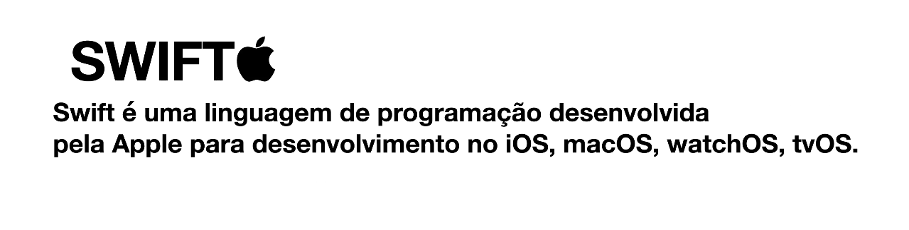
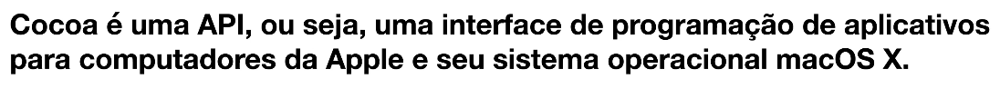

# Aula 1 -  07/03/2022

# O que é Swift?



Foi anunciada no WWDC (Conferencia anual da Apple) em 2014. Inicialmente como um software proprietário, e a partir da versão 2.2 (dezembro de 2015) foi distribuida como software livre sob a licença Apache 2.2.

Atualmente é uma das 20 linguagens mais populares.


Compilador é um programa que processa comandos escrito em uma linguagem de programação específica e o “traduz” em linguagem de máquina ou “código” que o processador utiliza.

## O que é Cocoa?



## Versões da Swift


 

## XCode

Como acessar: 

## Variáveis e Constantes

As variáveis podem ser mutáveis e imutáveis.

As variáveis do tipo `var` podem ser atribuídas outros valores diferentes de sua declaração.

```swift
var name = "Cristina"
name = "Larissa"
print(name)
```

As variáveis do tipo `let` são na verdade constantes e não podem receber valores diferentes do que foi atribuido.

```swift
// ao executar o código veja que dará error
let name = "Cristina"
name = "Larissa"
print(name)

```

### Interpolação de Strings

Interpolar de uma maneira clara é unir strings, e para fazer deve entre aspas com barra invertida e parênteses inserir o nome das strings que serão interpoladas.

```swift
var name = "Larissa"
var lastName = "Monteiro"
let age = 26

// Interpolação de String
let fullName = "Meu nome é \(name) \(lastName), minha idade é \(age)"
print(fullName)
```

### Tipos de variáveis

Int = Números inteiros
Double = Números flutuantes mais precisos
Float = Números flutuantes menos precisos
String = Strings
Bool = true or false

```swift
var idade: Int = 30
var quantidade: Double = 1.5
var distancia: Float = 1.3333
var nome: String = "Larissa"
var verdade: Bool = true
```

Os tipos complexos são importados da biblioteca `UIKit`.

```swift
var button: UIButton()
var label: UILabel()
```

## Operadores

Os operadores podem ser:

= Atribuiçao
== Comparaçao
!= Diferente de
< Menor
<= Menor igual a

>Maior
<=maior igual a

```swift
let compair = num1 > num2
print(compair)

let name = "Larissa"
let lastName = "Monteiro"
let res = name < lastName
print(res)
```

## Expressões

**! Operador de inversão**

```swift
let isHidden: Bool = false
let isEnable: Bool = true
print(!isHidden)
```

**|| = ou
&& = e**

```swift
let status = isHidden && isEnable || 10 < 50
print(status)
```

## Operadores de Incremento

+= Incremento
-= Decremento
numIncrement = numIncrement + 1 (Incremento)

## Condicionais

```swift
var idade: Int = 17

if idade >= 18 {
    print("Pode entrar")
}else if idade  == 17  {
    print("Entrada permitida com autorização dos pais.")
}else {
    print("Não pode entrar.")
}
```

```swift
var system: String
let company: String = "Apple"

if company == "Apple"{
    print("O sistema é IOS.")
}else{
    print("O sistema é Android.")
}
```

### If ternário

```swift
var system: String
let company: String = "Apple"
system = company == "Apple" ? "IOS" : "Android"
print(system)
```

## Array - Coleção de Dados

```swift
typealias tipo = String // define o tipo doos elementos

var frutas: [String] = ["Melancia", "Morango", "Banana", "Kiwi","laranja"]
print(frutas)

frutas.append("Mexerica") //adiciona um novo item no array
print(frutas)

frutas.insert("Limão", at: 0) //adiciona um novo item na posição informada
print(frutas)

frutas.removeLast() //remove o ultimo elemento
print(frutas)
```

## Tupla

```swift
var tupla: (String, Int, Bool) = ("Larissa", 26, true)
```

## Dicionary (Json em JavaScript)

```swift
// Declaração de uma pessoa

var dic: [String: Any] = ["name": "Larissa",
                          "email": "larimonteirodev@gmail.com",
                          "idade":26,
                          "Matriculade": true]

print(dic["Matriculade])
```

```swift
// Declaração de várias pessoas
var dic: [[String: Any]] = [["name": "Larissa",
                            "email": "larimonteirodev@gmail.com",
                            "idade":26,
                            "Matriculade": true],
                            ["name": "Gabriela",
                            "email": "gabriela@gmail.com",
                            "idade":19,
                            "Matriculade": true],
                            ["name": "Regis",
                            "email": "regis@gmail.com",
                            "idade":26,
                            "Matriculade": false],]

print(dic[2]["Matriculade"]) //é necessário colocar o indice
```
